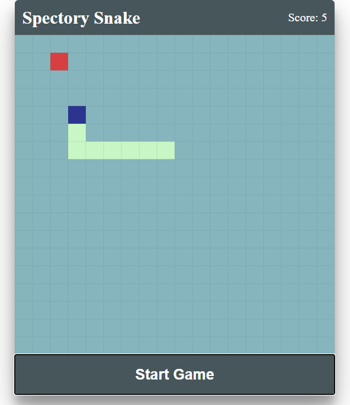

# Spectory Home Assignment

## Requirements:
### You should build an html-js-css Snake game.

1. You control the snake with the arrow keys.
2. You lose if you hit the edges or yourself.
3. Every time you collect food your size is increased by 1.
4. You may use any Framework you want, or none if you prefer.

#### The limitations are as follows:
1. You should not use any existing game engine
2. Use DOM elements (=meaning no Canvas).

